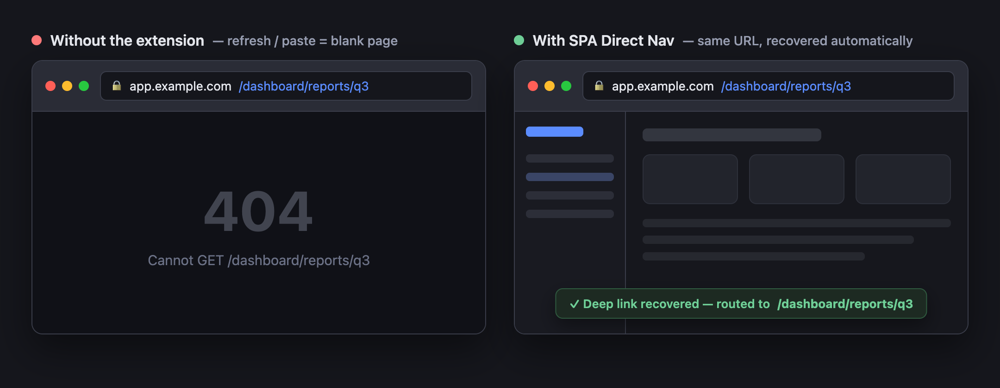
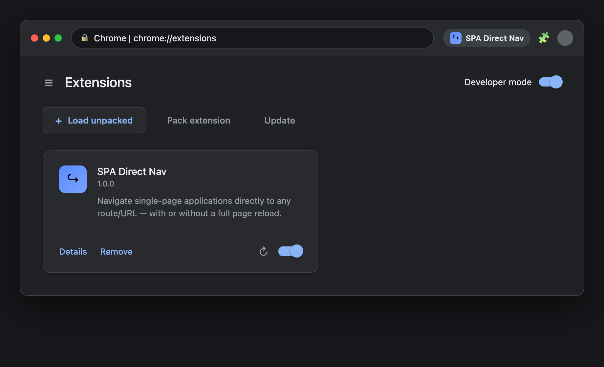
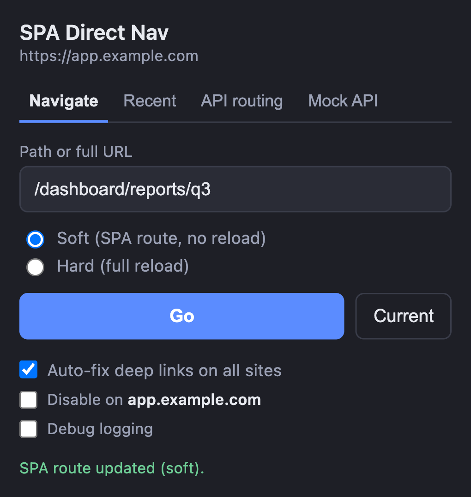

# SPA Direct Nav

A Chrome extension that lets you jump **straight to any route** in a single-page app
(React, Vue, Angular, …) — by typing the path, or just by pasting a deep link into the
address bar. No more clicking through menus to reach a page you already have the URL for.

It also fixes the classic single-page-app annoyance where **pasting or refreshing a deep
link shows a blank page / 404** (common on preview and feature-branch deploys).

<p align="center">
  
</p>

---

## Quick start

1. **Get the code** — download or clone this folder (`spa-direct-nav`) to your computer.
2. Open **`chrome://extensions`** in Chrome.
3. Turn on **Developer mode** (toggle, top-right).
4. Click **Load unpacked** and select the `spa-direct-nav` folder.
5. Click the **puzzle-piece icon** in the toolbar and **pin** "SPA Direct Nav" so its icon
   is always visible.

That's it — it's now active on every site. The address-bar auto-fix works with no further
setup.

<p align="center">
  
</p>

---

## How to use it

### A. Jump to a route from the popup

<p align="center">
  
</p>

1. Open the app you're working in (any SPA).
2. Click the **SPA Direct Nav** toolbar icon.
3. Type either:
   - a **path** — `/dashboard/settings`, or
   - a **full URL** — `https://app.example.com/dashboard/settings`
4. Press **Go** (or hit Enter).

Buttons in the popup:

- **Go** — navigate to what you typed.
- **Current** — fills the box with the current page's path (handy to tweak one segment).
- **Recent** — your last destinations; click any to go there again.

Two navigation modes (radio buttons):

| Mode | What it does | When to use |
| --- | --- | --- |
| **Soft** *(default)* | Changes the route **without reloading** the page (instant). | Normal use — staying inside the same app. |
| **Hard** | Does a full page reload at the URL. | If Soft doesn't update the view (a few routers need this). |

### B. Paste a deep link into the address bar (automatic)

Just paste a deep URL into Chrome's address bar and press Enter — or refresh a deep page,
or open a link someone shared. If the server can't serve that deep route directly (you'd
normally get a blank page or 404), **the extension quietly loads the app and takes you to
the right route**. You don't have to open the popup.

This is **on by default for every site** and only kicks in when a page actually fails to
load — normal pages are never touched.

Whenever the extension recovers a deep link — or navigates for you from the popup — a brief
**confirmation toast** appears at the bottom of the page (e.g. *“Deep link recovered — routed
to /dashboard/reports/q3”*), so you always know it acted.

### Settings (in the popup)

- **Auto-fix deep links on all sites** — master on/off for the address-bar fixing (on by default).
- **Disable on `<host>`** — turn the auto-fix off for just the site you're currently on.
- **Debug logging** — off by default. Turn it on if something isn't working and you want
  to see what the extension is doing (see [Troubleshooting](#troubleshooting)).

---

## Troubleshooting

**I changed/updated the extension and nothing happens.**
After any update, go to `chrome://extensions` and click the **reload ↻** icon on the
extension card. Then **reload the open tabs** you want it to work on — the in-page part
only attaches to pages opened *after* the reload.

**The address-bar auto-fix didn't fix a broken deep link.**
1. Open the popup and turn on **Debug logging**.
2. Reload the broken page.
3. Open the page's own DevTools console (**F12** → **Console**) and look for
   `[SPA Direct Nav · content]` lines — they say exactly what it tried and where it stopped.
4. For the background side, open `chrome://extensions` → click the **service worker** link
   on the card → its console shows `[SPA Direct Nav]` lines.

Common reasons it won't auto-fix (by design): the site isn't a single-page app, the deep
link is a genuine 404 everywhere, or the page lives behind a login that redirects.

**Soft mode changes the URL but the page doesn't update.**
A few routers (e.g. Next.js App Router) ignore the History API trick. Switch the popup to
**Hard** mode for that site.

---

## Privacy

Everything runs locally in your browser. The extension makes no calls to any server of its
own and collects no data. Its settings and "recent" list are stored only in your browser.
It needs broad site access (`<all_urls>`) so the auto-fix can work on any app you visit;
debug logging is **off by default** so your browsing isn't printed anywhere.

---

## For developers

### How it works

- **Soft navigation** uses the History API (`pushState` + synthetic `popstate`/`hashchange`)
  so the app's router re-renders without a reload.
- **Cold deep-links** (server 404s the route) are recovered by *probe-and-strip*: walk up
  the path (`/a/b/c` → `/a/b/` → `/a/` → `/`), find the deepest URL the server actually
  serves, load that app shell, wait for the router to mount, then soft-route to the full URL.
- **Address-bar auto-fix** is driven by real HTTP status: the background worker watches
  main-frame responses (`webRequest`) and only the confirmed-error pages attempt recovery,
  after verifying the base looks like an SPA shell. Probes run in the page, so auth cookies
  are sent. Results are memoized per origin to avoid repeat work.

### Files

| File | Purpose |
| --- | --- |
| `manifest.json` | MV3 manifest, permissions, popup wiring |
| `popup.html` / `popup.css` / `popup.js` | Popup UI and the in-place soft path |
| `background.js` | Service worker: smart-nav pipeline + `webRequest` error tracking |
| `content.js` | Address-bar auto-fix (detect HTTP error → recover) |
| `toast.js` | In-page confirmation toast (`window.__spaToast`) shown on every extension navigation |
| `lib.js` | Shared pure helpers (`spaFindServableBase`, `sameUrl`, `pathOf`, …) |
| `test/` | Node unit tests for `lib.js` |
| `icons/` | Toolbar icons |

### Tests

```sh
npm test     # or: node --test  (Node 18+, no dependencies)
```

### Permissions

- `tabs` / `activeTab` — read and update the active tab's URL.
- `scripting` + `host_permissions: <all_urls>` — run the soft-navigation routine in pages.
- `webRequest` — observe main-frame HTTP status so auto-fix only fires on real errors.
- `webNavigation` — invalidate stale error state when a new navigation starts.
- `storage` — keep settings and the recent list; transient error state uses `storage.session`.

### Limits

- Soft mode is **same-origin** only; a different host falls back to a full load.
- Recovery attempts **one** redirect per chain (a `sessionStorage` guard prevents loops);
  if the chosen base also errors, the page is left as-is.
- It can't run on restricted pages (`chrome://`, the Chrome Web Store, etc.).
